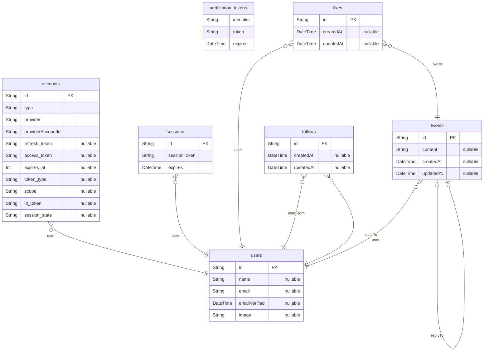

```mermaid
erDiagram

  accounts {
    String id PK 
    String type  
    String provider  
    String providerAccountId  
    String refresh_token  "nullable"
    String access_token  "nullable"
    Int expires_at  "nullable"
    String token_type  "nullable"
    String scope  "nullable"
    String id_token  "nullable"
    String session_state  "nullable"
    }
  

  sessions {
    String id PK 
    String sessionToken  
    DateTime expires  
    }
  

  users {
    String id PK 
    String name  "nullable"
    String email  "nullable"
    DateTime emailVerified  "nullable"
    String image  "nullable"
    }
  

  verification_tokens {
    String identifier  
    String token  
    DateTime expires  
    }
  

  tweets {
    String id PK 
    String content  "nullable"
    DateTime createdAt  "nullable"
    DateTime updatedAt  "nullable"
    }
  

  likes {
    String id PK 
    DateTime createdAt  "nullable"
    DateTime updatedAt  "nullable"
    }
  

  follows {
    String id PK 
    DateTime createdAt  "nullable"
    DateTime updatedAt  "nullable"
    }
  
    accounts o{--|| users : "user"
    sessions o{--|| users : "user"
    tweets o{--|| users : "user"
    tweets o|--|o tweets : "replyTo"
    likes o{--|| users : "user"
    likes o{--|| tweets : "tweet"
    follows o{--|| users : "userFrom"
    follows o{--|| users : "userTo"
```
